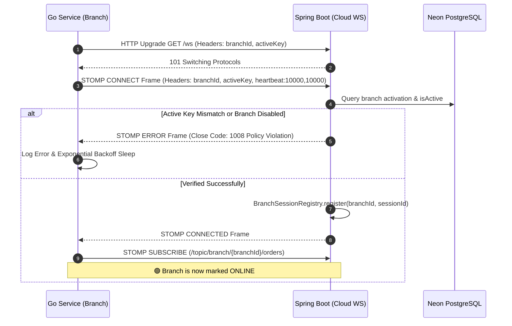

# SunPOS QR Ordering System: BA & SA Specification

> **Document Version:** 1.0.0  
> **Status:** Approved / In-Production  
> **Authors:** Senior Business Analyst (Sr. BA) & Senior Solution Architect (Sr. SA)  
> **Target Subsystems:** `qrorder` (Customer Frontend), `backend` (Spring Boot Cloud), `backapp` (Branch Go Service), `sunpos` (POS Cashier)

---

## 1. Business Analysis (BA) Specification

### 1.1 Business Objectives & Context
SunPOS is introducing a **Cloud-First QR Ordering** feature enabling seated dining customers to view menu catalogs, customize dishes, and place orders directly from their mobile smartphones via QR codes placed at dining tables.

**Key Business Goals:**
1. **Reduce Waitstaff Labor & Order Errors**: Eliminate paper-based order taking and manual cashier re-entry.
2. **Increase Table Turnover & Average Order Value (AOV)**: Give customers instant ordering capability with high-resolution imagery and clear customization choices.
3. **Zero Firewall Hassle at Branches**: Branch restaurant hardware must not require static public IPs, dynamic DNS, or router port-forwarding to receive live orders.
4. **Offline Resilience**: Kitchen staff must continue receiving orders reliably even through momentary internet fluctuations.

### 1.2 User Personas & Core User Stories

| Persona | Role | Core Need |
| :--- | :--- | :--- |
| **Diner (Customer)** | Seated at Table | Scans table QR code, selects menu items, enters notes (e.g. "ไม่ใส่ผัก"), and places order without needing to download any native app or log in. |
| **Kitchen Chef** | Food Preparation | Receives immediate thermal paper kitchen tickets with large table numbers, dish quantities, and special notes; can request reprints if tickets are damaged. |
| **Cashier / Waiter** | Billing & Monitoring | Sees customer orders appearing on the main POS in real-time; can review aggregated bills and collect payments upon customer departure. |
| **Restaurant Owner / Ops** | Operation & IT | Monitors whether branches are Online/Offline and tracks order acknowledgment latency without complex networking tools. |

### 1.3 Key Functional Requirements (FR)

- **FR-01: Zero-Authentication Customer Access**: Public API endpoint for menu retrieval and order submission without requiring passwords or SMS OTP.
- **FR-02: URL Context Parsing**: Frontend automatically extracts `branchId` and `tableNumber` from URL parameters (e.g., `?branchId=branch-001&tableNumber=A05` or `/menu/branch-001/A05`).
- **FR-03: Multi-Level Customization & Notes**: Supports dish options (e.g., spicy levels) and item-specific notes ("ขอสุกๆ"), as well as table-wide instructions ("ขอน้ำจิ้มเพิ่ม 2 ถ้วย").
- **FR-04: Duplicate Submission Protection**: Idempotency token sent per checkout session to guarantee identical orders are not double-charged if customers tap submit repeatedly.
- **FR-05: Real-Time Kitchen Dispatch**: Instant push from cloud to the physical branch machine over WebSocket within < 500ms.
- **FR-06: Autonomous Kitchen Printing**: Instant raw thermal slip printing (ESC/POS) on local LAN network printer (Port 9100) with acoustic buzzer alert.
- **FR-07: Reprint Facility**: Ability to reprint lost or damaged kitchen tickets with an explicit `[ พิมพ์ซ้ำ / REPRINT ]` heading.
- **FR-08: Automatic Offline Reconciliation**: Fallback poller running every 30s to catch unacknowledged orders during network recovery.

---

## 2. Solution Architecture (SA) Specification

### 2.1 System Context & Component Diagram

```
[ Customer Mobile Web (qrorder) ]
          |  (HTTPS / REST)
          v
+-----------------------------------------------------------+
|               CLOUD INFRASTRUCTURE (Neon AWS)             |
|                                                           |
|   [ Spring Boot Modular Monolith (Kotlin 2.1) ]           |
|   - PublicOrderController (/api/public/orders)            |
|   - WebSocket Message Broker (/ws, STOMP 1.2)             |
|   - ActiveKeyChannelInterceptor (Auth Guard)              |
|   - BranchSessionRegistry (Live Online/Offline State)     |
|   - BranchOrderPushService (/topic/branch/{id}/orders)    |
|   - InternalOrderAckController (/api/internal/orders/ack) |
|   - Neon PostgreSQL (Serverless, Flyway V32)              |
+-----------------------------------------------------------+
          ^
          | (Outbound STOMP over WebSocket + TLS)
          |
+-----------------------------------------------------------+
|               BRANCH LOCAL RESTAURANT LAN                 |
|                                                           |
|   [ Go 1.27 Service (backapp) ]                           |
|   - qr_order_listener.go (STOMP Client + Backoff Retry)   |
|   - Local SQLite WAL Database (pos.db)                    |
|   - kitchen_printer.go (ESC/POS Builder & TCP Sender)     |
|   - Fallback Poller (Safety-net 30s interval)             |
|   - Local REST Supervisor API (Port 8888)                 |
+-----------------------------------------------------------+
          |
          | (Raw TCP Socket Port 9100)
          v
[ Kitchen Thermal Printer (80mm / 58mm) ]
```

---

## 3. Communication & Synchronization Protocols

### 3.1 Authentication Handshake (Active Key Flow)

Physical branches authenticate with Cloud using **Active Keys** (e.g. `SUN-BRANCH-001-KEY`) stored in `device_identity` / `branches`.



### 3.2 End-to-End Order Lifecycle Flow

```mermaid
sequenceDiagram
    autonumber
    actor Diner as ลูกค้า (Mobile Web)
    participant Cloud as Cloud Backend
    participant Branch as Go Service (สาขา)
    participant SQLite as Local SQLite (pos.db)
    participant Printer as Kitchen Thermal Printer

    Diner->>Cloud: POST /api/public/orders (Idempotency-Key: UUID)
    Cloud->>Cloud: Insert qr_orders (status = 'pending')
    Cloud-->>Diner: 200 OK (orderId, status = 'pending')
    
    alt Branch is Online in SessionRegistry
        Cloud->>Branch: STOMP MESSAGE on /topic/branch/{branchId}/orders
        Cloud->>Cloud: Update status = 'sent_to_branch'
        Branch->>SQLite: BEGIN TRANSACTION; INSERT qr_orders, qr_order_items; COMMIT;
        Branch-->>Cloud: POST /api/internal/orders/{orderId}/ack
        Cloud->>Cloud: Update status = 'received'
        Branch->>Printer: Raw TCP 9100 (ESC/POS Bytes)
        Printer-->>Branch: Slip Printed & Paper Cut
        Branch->>SQLite: UPDATE qr_orders SET print_status = 'printed'
    else Branch is Offline
        Note over Cloud: Order remains in 'pending' status
        Note over Branch: Branch reconnects or Fallback Poller triggers
        Branch->>Cloud: GET /api/v1/qr/branch/{branchId}/pending
        Cloud-->>Branch: Returns unacknowledged orders
        Branch->>SQLite: Transaction Save & Print & Send ACK
    end
```

---

## 4. Database Specifications

### 4.1 Cloud Database (Neon PostgreSQL)

```sql
CREATE TABLE IF NOT EXISTS qr_orders (
    id VARCHAR(36) PRIMARY KEY,
    branch_id VARCHAR(36) NOT NULL,
    table_number VARCHAR(50) NOT NULL,
    status VARCHAR(30) NOT NULL DEFAULT 'pending',
    customer_note TEXT,
    total_amount NUMERIC(12, 2) NOT NULL DEFAULT 0.00,
    source VARCHAR(20) NOT NULL DEFAULT 'qr',
    idempotency_key VARCHAR(100),
    created_at TIMESTAMP WITH TIME ZONE NOT NULL DEFAULT CURRENT_TIMESTAMP,
    updated_at TIMESTAMP WITH TIME ZONE NOT NULL DEFAULT CURRENT_TIMESTAMP
);

CREATE UNIQUE INDEX uk_qr_orders_idempotency_key 
ON qr_orders (idempotency_key) 
WHERE idempotency_key IS NOT NULL;

CREATE INDEX idx_qr_orders_branch_status_created 
ON qr_orders (branch_id, status, created_at DESC);

CREATE TABLE IF NOT EXISTS qr_order_items (
    id VARCHAR(36) PRIMARY KEY,
    order_id VARCHAR(36) NOT NULL REFERENCES qr_orders(id) ON DELETE CASCADE,
    product_id VARCHAR(36) NOT NULL,
    product_name VARCHAR(255) NOT NULL,
    quantity INT NOT NULL DEFAULT 1,
    unit_price NUMERIC(12, 2) NOT NULL DEFAULT 0.00,
    options TEXT,
    note TEXT
);
```

### 4.2 Branch Local Database (SQLite in `pos.db`)

```sql
CREATE TABLE IF NOT EXISTS qr_orders (
    id TEXT PRIMARY KEY,
    cloud_order_id TEXT UNIQUE,
    branch_id TEXT NOT NULL,
    table_number TEXT NOT NULL,
    status TEXT NOT NULL DEFAULT 'pending',
    customer_note TEXT,
    total_amount REAL NOT NULL DEFAULT 0.0,
    source TEXT NOT NULL DEFAULT 'qr',
    print_status TEXT NOT NULL DEFAULT 'pending',
    printed_at TEXT,
    synced_at TEXT,
    created_at TEXT NOT NULL,
    updated_at TEXT NOT NULL
);

CREATE TABLE IF NOT EXISTS qr_order_items (
    id TEXT PRIMARY KEY,
    order_id TEXT NOT NULL REFERENCES qr_orders(id) ON DELETE CASCADE,
    product_id TEXT NOT NULL,
    product_name TEXT NOT NULL,
    quantity INTEGER NOT NULL DEFAULT 1,
    unit_price REAL NOT NULL DEFAULT 0.0,
    options TEXT,
    note TEXT
);
```

---

## 5. Kitchen Printing Engine (ESC/POS Specification)

Thermal printing connects via **Raw TCP Socket to Port 9100** (Standard JetDirect / RAW protocol) without OS printer spoolers or drivers:

### Slip Template Layout:
```
================================
โต๊ะ: {tableNumber}             <-- 2x Double Height & Width (GS ! 0x11)
เวลา: {HH:mm:ss น.}
ออเดอร์: #{shortOrderId}
--------------------------------
{qty}x {productName}           <-- Bold (ESC E 1)
   หมายเหตุ: {note}
   ตัวเลือก: {options}
--------------------------------
หมายเหตุรวม: {customerNote}
================================
<Paper Feed 3 Lines>
<Partial Cut Command (GS V B 0)>
```

### Reprint Indicator:
When triggered via `POST /api/orders/qr/{orderId}/reprint`, the top of the slip is prepended with:
```
*** [ พิมพ์ซ้ำ / REPRINT ] ***
```

---

## 6. Monitoring, Reliability & SLAs

### 6.1 Real-Time Health & Monitoring APIs
- `GET /api/internal/branches/{branchId}/status`: Returns live connection state (`isOnline`), `connectedAt`, and `pendingOrdersCount`.
- `GET /api/internal/branches/status`: Lists all online branches across the entire organization.

### 6.2 Service Level Objectives (SLOs)
- **Order Dispatch Latency**: < 500ms from customer submit to local branch receipt under normal network conditions.
- **Deduplication SLA**: 100% rejection of duplicate requests bearing identical `Idempotency-Key` headers.
- **Offline Recovery Time**: < 30 seconds for branch Fallback Poller to reconcile unprinted orders upon internet restoration.
